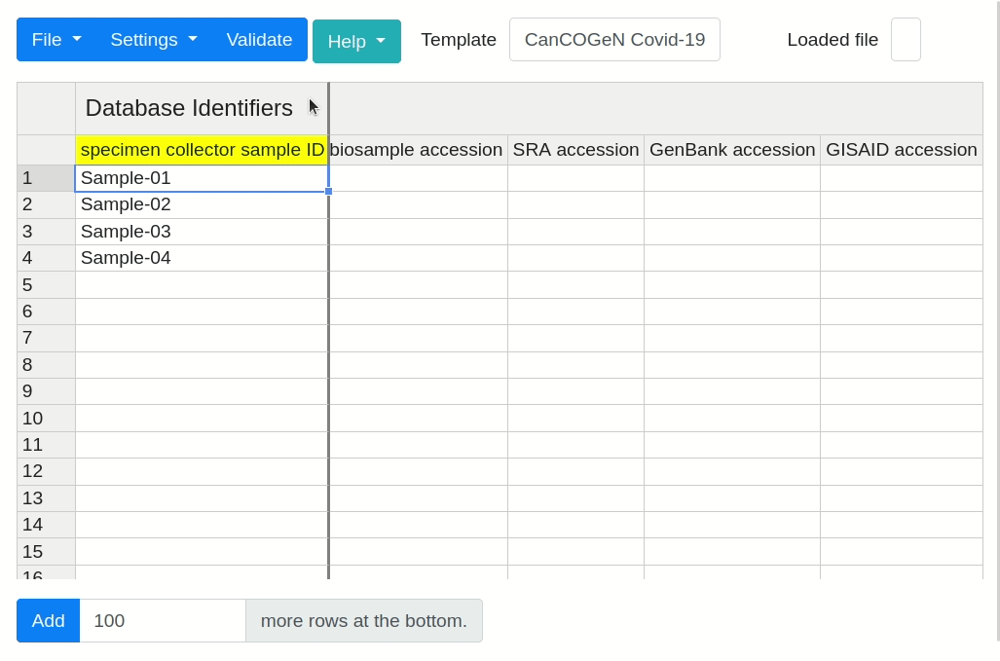

# DataHarmonizer

A standardized spreadsheet editor and validator that can be run offline and locally, and which includes a template for SARS-CoV-2 sampling data.

|Chrome|Firefox|Edge|
|---|---|---|
|49+|34+|12+|

## Installation

Download the zipped source code from the latest release at:
https://github.com/Public-Health-Bioinformatics/DataHarmonizer/releases

Extract the zipped file.

To run the application, navigate to the extracted folder and open `main.html`.

## Select Template

The default template loaded is the "CanCOGeN Covid-19" template. To change the spreadsheet template, select the white text box to the right of "Template", it always contains the name of template currently active. An in-app window will appear that allows you to select from the available templates in the drop-down menu. After selecting the desired template, click "open" to activate the template.

## Usage

You can edit the cells manually, or upload `xlsx`, `xls`, `tsv` and `csv` files. You 
can also save the spreadsheet's contents to your local hard-drive.

Click the validate button to validate your spreadsheet's values against a 
standardized vocabulary.

Double click any column headers for information on the grid's vocabulary.

A second way to access templates directly, rather than by the hard-coded menu system, is to specify the DataHarmonizer template subfolder via a "template" URL parameter. This enables development and use of customized templates, or new ones, that DH doesn't have programmed in menu.  For example, 
http://genepio.org/DataHarmonizer/main.html?template=gisaid accesses the /template/gsiaid/ subfolder's template directly.  See more on the Wiki [DataHarmonizer templates](https://github.com/Public-Health-Bioinformatics/DataHarmonizer/wiki/DataHarmonizer-Templates) page.

## Additional Information

For more information about the DataHarmonizer, it's templates, and how to use them, check out the [DataHarmonizer Wiki](https://github.com/Public-Health-Bioinformatics/DataHarmonizer/wiki).

## Support

If you have any ideas for improving the application, or have encountered any 
problems running the application, [please open an issue for discussion][1]. 

[1]: https://github.com/Public-Health-Bioinformatics/DataHarmonizer/issues

## Roadmap

This project is currently in the beta phase, with new features being added
occasionally.

## Acknowledgement

[Handsontable](https://handsontable.com/) was used to build the grid. 
[SheetJS](https://sheetjs.com/) was used to open and save local files.

## License

[MIT](LICENSE)
