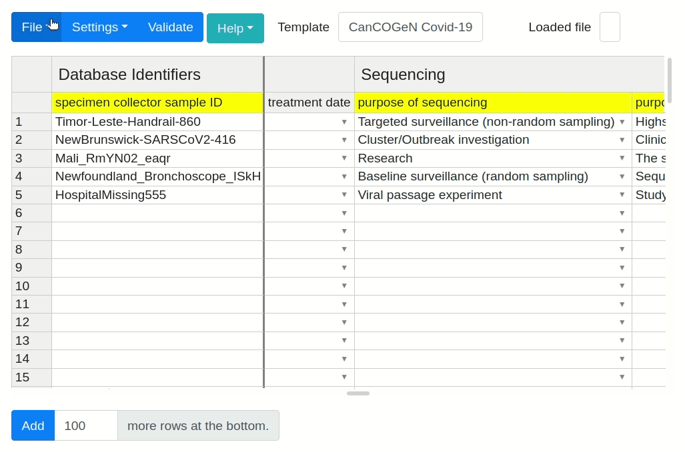
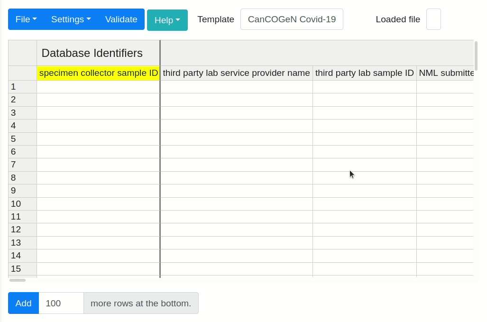
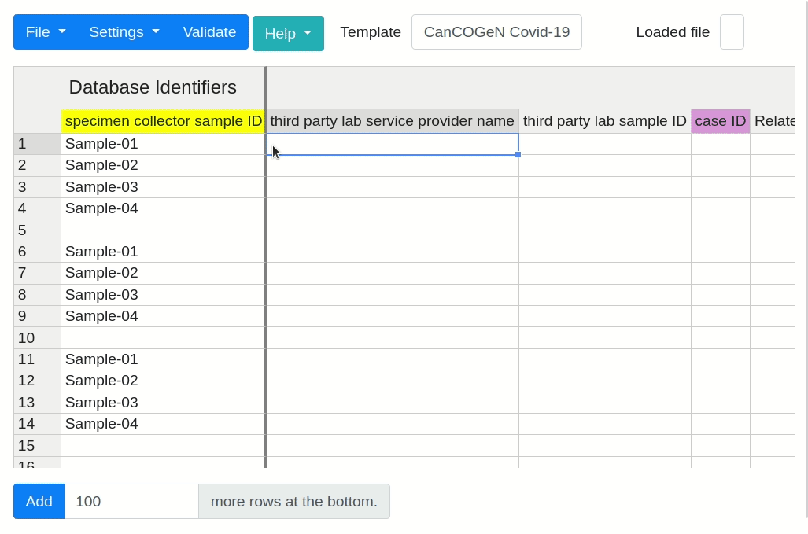
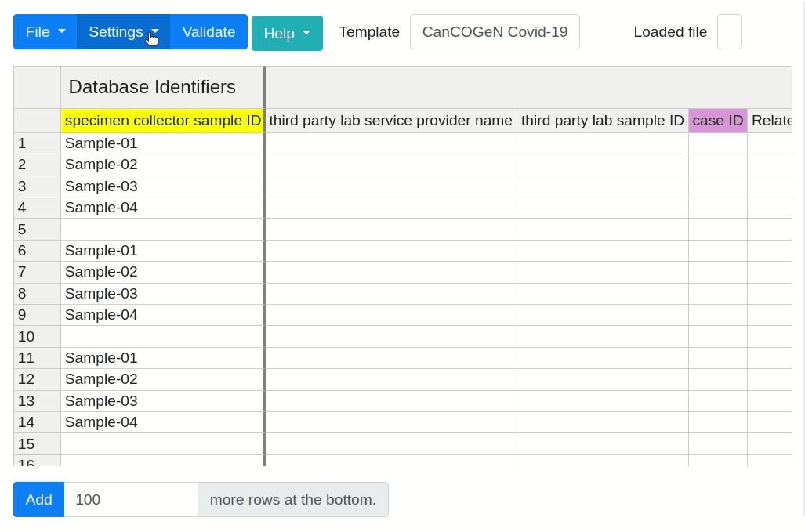

# DataHarmonizer

A standardized spreadsheet editor and validator that can be run offline and locally, and which includes templates for SARS-CoV-2 sampling data.  

Watch Rhiannon Cameron and Damion Dooley describe this application on [YouTube](https://www.youtube.com/watch?v=rdN2_Vhwb8E&t=38s&ab_channel=CANARIEInc.) at the Canadian Research Software Conference (CRSC2021).

|Chrome|Firefox|Edge|
|---|---|---|
|49+|34+|12+|

## Installation

Download the zipped source code from the latest release at:
https://github.com/Public-Health-Bioinformatics/DataHarmonizer/releases

Extract the zipped file.

To run the application, navigate to the extracted folder and open `main.html`.

## Select Template

The default template loaded is the "CanCOGeN Covid-19" template. To change the spreadsheet template, select the white text box to the right of **Template**, it always contains the name of template currently active, or navigated to **File** followed by **Change Template**. An in-app window will appear that allows you to select from the available templates in the drop-down menu. After selecting the desired template, click **Open** to activate the template.

A second way to access templates directly, rather than by the hard-coded menu system, is to specify the DataHarmonizer template subfolder via a "template" URL parameter. This enables development and use of customized templates, or new ones, that DH doesn't have programmed in menu.  

For example,
http://genepio.org/DataHarmonizer/main.html?template=gisaid accesses the /template/gsiaid/ subfolder's template directly.  

See more on the Wiki [DataHarmonizer templates](https://github.com/Public-Health-Bioinformatics/DataHarmonizer/wiki/DataHarmonizer-Templates) page.

## Usage

You can edit the cells manually, or upload `xlsx`, `xls`, `tsv` and `csv` files via **File** > **Open**. You can also save the spreadsheet's contents to your local hard-drive in the aforementioned formats, or **File** > **Export** your data as an `.xls` document formatted for submission a specified portal, database, or repository.

Click the **Validate** button to validate your spreadsheet's values against a
standardized vocabulary. You can then browse through the errors using the **Next Error** button. Missing value are indicated in _dark red_, while incorrect values are _light red_.

Double click any column headers for information on the template's vocabulary.

You can quickly navigate to a column by selecting **Settings** > **Jump to...**. An in-app window will appear, select the desired column header from the drop-down list or begin typing it's name to narrow down the list options. Selecting the column header from the drop down list will immediately relocate you to that column on the spreadsheet.

You can also automatically fill a column with a specified value, but only in rows with corresponding values in the first `sample ID` column. To use this feature select **Settings** > **Fill column...**. Select the desired column header from the drop-down list or begin typing it's name to narrow down the list options, then specify the value to fill with and click **Ok** to apply.

For _more information_ on available application features, select the **Help** button followed by **Getting Started** from within the DataHarmonizer application.

## Additional Information

For more information about the DataHarmonizer, it's templates, and how to use them, check out the [DataHarmonizer Wiki](https://github.com/Public-Health-Bioinformatics/DataHarmonizer/wiki).

## Support

If you have any ideas for improving the application, or have encountered any
problems running the application, [please open an issue for discussion][1].

[1]: https://github.com/Public-Health-Bioinformatics/DataHarmonizer/issues

## Roadmap

This project is currently in the beta phase, with new features being added
occasionally.

## Acknowledgement

[Handsontable](https://handsontable.com/) was used to build the grid.
[SheetJS](https://sheetjs.com/) was used to open and save local files.

## License

[MIT](LICENSE)
